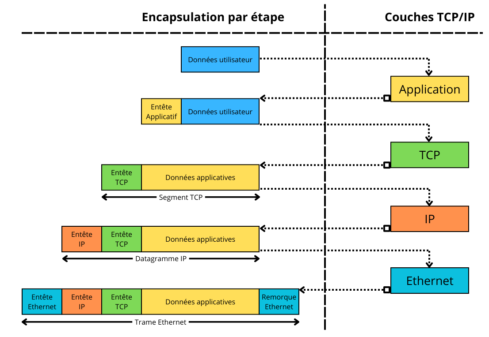
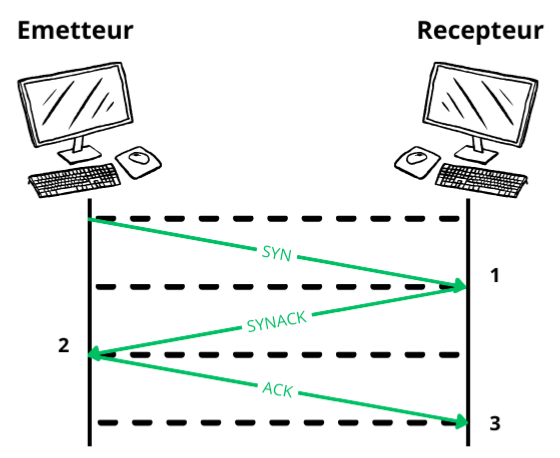
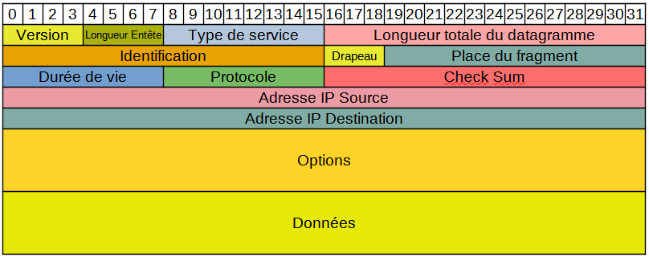
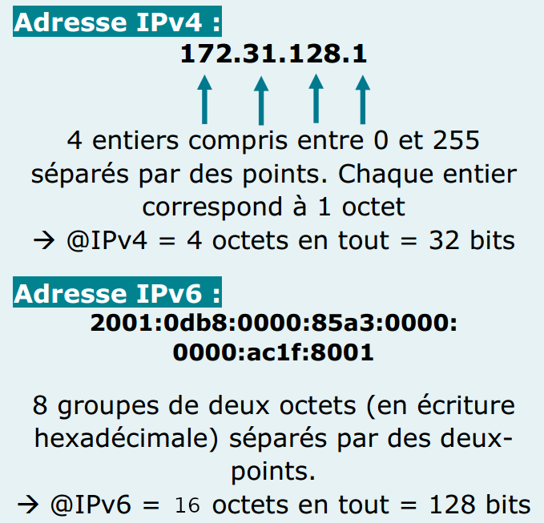

# Le protocole TCP/IP 

## Ce qu'en dit le programme:

Internet est défini par le protocole IP (Internet Protocol), ensemble de normes qui permettent d’identifier et de nommer de façon uniforme tous les ordinateurs ou objets qui lui sont connectés. 

IP est accompagné de protocoles de transmission pour transférer l’information par paquets, le principal étant TCP/IP (Transmission Control Protocol). 

De nature logicielle, internet s’appuie sur une grande variété de réseaux physiques où IP est implémenté. Il uniformise l’accès à tous les ordinateurs, les téléphones et les objets connectés.

## Une vidéo pour commencer

<iframe width="80%" height="400 px" src="https://www.youtube.com/embed/aX3z3JoVEdE?si=jgwzKquTVDe1B357" title="YouTube video player" frameborder="0" allow="accelerometer; autoplay; clipboard-write; encrypted-media; gyroscope; picture-in-picture; web-share" referrerpolicy="strict-origin-when-cross-origin" allowfullscreen></iframe>

!!! question "Exercice d'auto-évaluation"
    Après avoir regardé la vidéo: 
    
    * **tester** ses connaissances en répondant au QCM et
    * **faire** une capture d'écran de votre score 
    * **renommer** le fichier par "nom_prenom_classe" et  
    * me **l'envoyer** : 
    
    <!-- 
    
*Cliquer sur le pictogramme*   [{ width=10%}]([Lien vers le test](https://numeres.net/9782206103389/res/9782206103389-ht5-snt-03/index.html){target="_blank"})
 --> 
    
    [Lien vers le test](https://numeres.net/9782206103389/res/9782206103389-ht5-snt-03/index.html){target="_blank"}

!!! quote "Définition"

    * **TCP (Transmission Control Protocol)**: c'est le protocole qui assure la transmission de données entre une source et une destination.   
    * **IP (Internet Protocol)** : c’est un protocole sans connexion. Ce qui signifie que chaque unité de données est adressée et acheminée individuellement du périphérique source au périphérique cible, et la cible n’envoie pas d’accusé de réception à la source.

    TCP/IP est donc un protocole qui permet la communication entre les équipements au sein d’un réseau. Il est au coeur de l'architecture d'internet et est utilisé par tous les services internet pour communiquer : _les sites WEB, les jeux en line, le streaming, etc_.

## Modèle OSI Vs Modèle TCP/IP

TCP/IP fonctionne par couche ainsi on parle aussi de couches TCP/IP.
On peut parfois aussi parler de piles TCP/IP.    
Le protocole TCP/IP reprend en grande partie le **modèle OSI (Open Systems Interconnection)** qui est un modèle théorique.

{:width=80%}

!!! tip "Important"
    Le modèle OSI propose 7 couches mais l’architecture TCP/IP est une version simplifiée.

## L'encapsulation
!!! quote "Définition" 
    L'encapsulation, en informatique, est un procédé consistant à inclure les données d'un protocole dans un autre protocole.

Les différentes couches du protocole TCP / IP utilisent l'encapsulation dont voici le fonctionnement :

{:width=80%}

## Le protocole TCP

Quand un ordinateur "emeteur" doit envoyer des données à un ordinateur "récepteur", l'émeteur utilise le protocole TCP pour mettre en forme les données à envoyer.

Pour vérifier que les paquets sont bien arrivés le protocole TCP utilise une poignée de main à trois temps :

{ width=70% }

## Le protocole IP

IP est l'abréviation de Internet Protocol.

Il s'agit d'un protocole de base qui permet la communication et l'échange de données dans les réseaux informatiques, y compris le réseau mondial que nous connaissons sous le nom d'Internet.

Le protocole IP utilise un système d'adressage numérique pour identifier les appareils sur un réseau. Ces adresses numériques sont appelées adresses IP et peuvent être en IPv4 ou en IPv6.

### Le datagramme IP

{ width=90% }

{ width=100% }

Les adresses IPv4 se présentent généralement sous la forme de quatre séries de nombres décimaux (par exemple, 192.168.1.1), tandis que les adresses IPv6 sont plus longues et utilisent la notation hexadécimale.

{ width=50% }

Le protocole IP utilise également ce que l'on appelle les masques de sous-réseaux (netmask). Elle permet d'identifier, dans une adresse IP, la partie qui identifie le réseau de celle qui identifie la machine sur un réseau.
Dans l'exemple 192.168.1.1 avec un masque de 255.255.255.0, l'identifiant du réseau sera: 192.168.1.X et l'identifiant de la machine X.X.X.1.

Pour la communication avec les réseaux extérieurs (via internet), c'est le routeur qui traduit les adresses privées en une adresse IP externe unique et "publique". Inversement, en cas de trafic entrant, c'est votre routeur qui traduit l’adresse IP publique en adresse IP privée vers l’appareil du destinataire des données.

## Le routage des paquets

Internet, c'est un réseau géant qui connecte des millions de plus petits réseaux entre eux, un peu comme des routes reliant des villes. Pour que les informations (comme un message ou une vidéo) puissent circuler, elles passent par des routeurs, des appareils qui jouent le rôle de guides.

### Le rôle des routeurs

Les routeurs relient les différents réseaux et savent comment envoyer les données là où elles doivent aller. Imagine que chaque réseau est une ville, et les routeurs sont comme des panneaux de signalisation qui montrent la meilleure direction à prendre pour rejoindre la destination.

### Comment ça marche ?

1. Les données que tu envoies ou reçois voyagent sous forme de paquets (petits morceaux d'information).
2. Ces paquets passent par plusieurs routeurs sur le chemin.
3. Chaque routeur décide de la meilleure "route" pour envoyer le paquet vers sa destination, en fonction des connexions disponibles.
4. Tous les paquets arrivent enfin à destination et se regroupent pour reformer l'information complète.

C'est grâce aux routeurs et à leur organisation qu'Internet fonctionne comme une grande toile mondiale connectant tout le monde.

## Les différents types de réseaux

1. **Réseau personnel (PAN - Personal Area Network)**
    * Portée : Quelques mètres (autour d'une personne).
    * Exemple : La connexion entre un smartphone et des écouteurs Bluetooth ou un ordinateur et une imprimante sans fil.

2. **Réseau local (LAN - Local Area Network)**
    * Portée : Un bâtiment ou une zone restreinte (comme une maison, une école ou un bureau).
    * Exemple : Les ordinateurs connectés dans une classe via un câble ou une connexion Wi-Fi.

3. **Réseau local sans fil (WLAN - Wireless LAN)**
    * Portée : Semblable à un LAN, mais sans fil.
    * Exemple : Les connexions Wi-Fi dans une maison, une bibliothèque ou un café.

4. **Réseau métropolitain (MAN - Metropolitan Area Network)**
    * Portée : Une ville ou une grande zone géographique.
    * Exemple : Le réseau d'un campus universitaire ou la connexion Internet entre plusieurs bureaux d'une entreprise dans une même ville.

5. **Réseau étendu (WAN - Wide Area Network)**
    * Portée : Très grande, couvrant un pays, un continent, ou même le monde entier.
    * Exemple : Internet, qui est le plus grand WAN existant.

6. **Réseau privé virtuel (VPN - Virtual Private Network)**
    * Portée : Variable, puisqu'il utilise des réseaux publics comme Internet pour créer une connexion sécurisée entre deux points.
    * Exemple : Les employés travaillant à distance utilisent un VPN pour accéder au réseau sécurisé de leur entreprise.

7. **Réseau pair-à-pair (P2P - Peer-to-Peer)** 
    * Fonctionnement : Les appareils se connectent directement entre eux sans passer par un serveur central. Chaque ordinateur sert à la fois d'émetteur et de récepteur
    * Exemple : Les plateformes de partage de fichiers comme BitTorrent.

8. **Réseau de stockage (SAN - Storage Area Network)** 
    * Fonctionnement : Conçu pour connecter des serveurs à des dispositifs de stockage hautes performances.
    * Exemple : Utilisé dans les grandes entreprises pour gérer leurs données.

9. **Réseau IoT (Internet of Things)**
    * Portée : Variable, en fonction des appareils connectés (mais souvent local ou métropolitain).
    * Exemple : Les objets connectés, comme les thermostats intelligents ou les capteurs dans une usine.

!!! info "Résumé simplifié des types de réseaux par grandeur"
    * **Petit** : PAN, LAN, WLAN.
    * **Moyen** : MAN.
    * **Grand** : WAN, Internet.
    * **Spécifique** : VPN, P2P, SAN, IoT.

