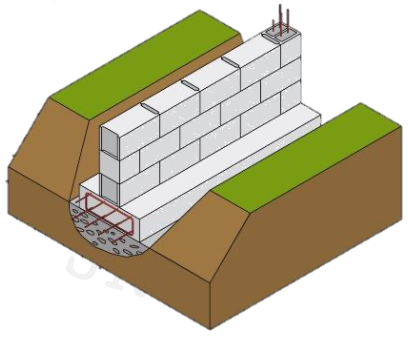
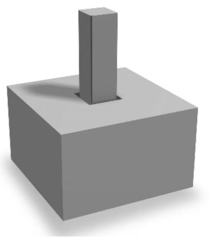
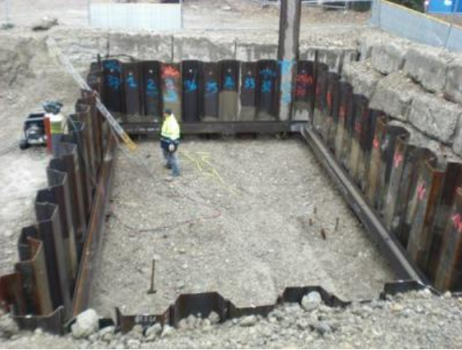

# LES FONDATIONS

## 1. INTRODUCTIONS

Les fondations d'un ouvrage sont un élément très important : grâce à elles, l'ouvrage transmet les efforts au sol et est maintenu.  

Pour transmettre les efforts, il faut, au préalable, les déterminer, il s'agit du résultat de la __descente de charges__.  

Par la suite, il faut connaitre le __type de sol__ qui se trouvera sous l'ouvrage afin d'en connaitre la __portance__ ou __la contrainte admissible__.  

Deux cas sont possibles :  
- Soit la contrainte admissible de la couche superficielle du sol est __suffisante__, et dans ce cas, on utilisera des fondations dites __superficielles__.
- Soit la contrainte admissible de la couche superficielle de sol est __insuffisante__ et dans ce cas, il faut aller lus profondément chercher le « __bon sol__ », on utilisera des fondations __profondes__.  

La caractérisation du comportement du sol est très complexe, car il s'agit d'un matériau hétérogène dont les caractéristiques sont très variables : site, météo, profondeur. Plusieurs méthodes de calculs existent donc, on peut citer Rankine, Bousinesk, Coulomb. Cette science de l'étude du sol est appelée géotechnique.

## 2. LES FONDATIONS SUPERFICIELLES

### 2.1 LES TYPES

Les fondations superficielles sont donc des fondations qui sont implantées dans les couches de sols superficielles, à une faible profondeur (quelques mètres).  

Il existe 3 type de fondations superficielles :  

- Le __radier__ est une dalle permettant la répartition de l'ensemble des charges au sol. Cet élément est utilisé essentiellement pour des maisons individuelles, car les charges doivent être faibles et assez homogènes pour ne pas déséquilibrer le radier.  
{: .imgcentre width=200px}  

- La __semelle filante__ est un élément long qui soutient les murs. Les charges reprises sont donc linéiques N/ml.  
{: .imgcentre width=150px}  

- La __semelle isolée__ est un élément ponctuel, qui reprend les charges venant d'un poteau. Ces charges reprises sont donc ponctuelles [N].  
{: .imgcentre width=100px}  

### 2.2 LES LONGRINES

{: .imgcentre width=200px} 

Pour éviter d'avoir des __tassements différentiels__, on peut __liaisonner__ les fondations avec des __longrines__, qui sont des poutres enterrées et qui solidarisent les fondations entre-elles.  On utilise très souvent des longrines lorsque l'ouvrage est en zone __sismique__, on parle alors de longrines parasismiques.  Un séisme produit un effort __horizontal__, il est donc très important d'avoir un système de fondation capable de reprendre ce type d'efforts.

## 3. LES FONDATIONS PROFONDES

Il existe 2 types de fondations profondes, dont les natures sont assez voisines. En effet, le fait d'ancrer profondément les fondations ne permet pas de réaliser des geometries complexes comme pour les fondations superficielles. On réalise donc souvent des ouvrages circulaires.

### 3.1 LES PUITS

Les puits sont des fondations __profondes__ dont le rapport _Hauteur/Diamètre (H/D)_ est : __4 < H/D < 10__.  
Les puits sont généralement réalisés en gros béton (béton de moyenne qualité) et non armé.

### 3.2 LES PIEUX

Les pieux dont le rapport est __H/D > 10__ sont réalisés avec des armatures, car il s'agit d'éléments de structure __allongés filiformes__, nécessitant donc un __renforcement__.  
Les pieux sont utilisés pour des bâtiments __lourds__, tels que les immeubles ou gratte-ciel, qui transmettent __beaucoup de charges__ sur une __petite surface d'emprise au sol__. Cette surface étant trop petite pour la quantité d'effort, il est généralement impossible de réaliser des fondations superficielles.  
Il se peut néanmoins qu'en présence d'un sol particulièrement __mauvais__, l'on doive fonder un petit bâtiment sur des pieux.  

_Par exemple, le Burj Khalifa au Emirats Arabes Unis, gratte-ciel de 828m possède 192 pieux de 43m de profondeur._
  

On peut chercher à ancrer le pieu sur une couche de __sol dur__, comme de la __pierre__ afin de transmettre des efforts à celle-ci, mais on réalise également des pieux dont la stabilité est __uniquement__ assurée par les __frottements__, dans ce cas, il s'agit de __pieux flottants__.  

## 4. LES AUTRES TYPES

On peut également utiliser d'autres types de fondations, mai qui se rapproche davantage des ouvrages de soutènement.  

On peut citer :  
- Les __parois moulées__, généralement utilisées pour les parkings ou les ouvrages ayant une partie importante enterrée.  

- Les __micropieux__ (même principe que les pieux mais on cherche à imiter les charges sur ceux-ci). Ils sont plus petits que des pieux ordinaires.  

- Les __palplanches__ (surtout pour les ouvrages maritimes et fluviaux mais également comme ouvrage de soutènement).  
{: .imgcentre width=200px} 

## 5. LE DIMENSIONNEMENT

$$\underbrace{[\overset{\textcolor{red}{_\wedge^{0}}}{14}, 15, 17, 22,}_{ } \underset{_4^\uparrow}{\textcolor{darkblue}{23}} , \overbrace{25, 29, 34, \underset{\textcolor{red}{_8^{\vee}}}{38}]}_{ }$$