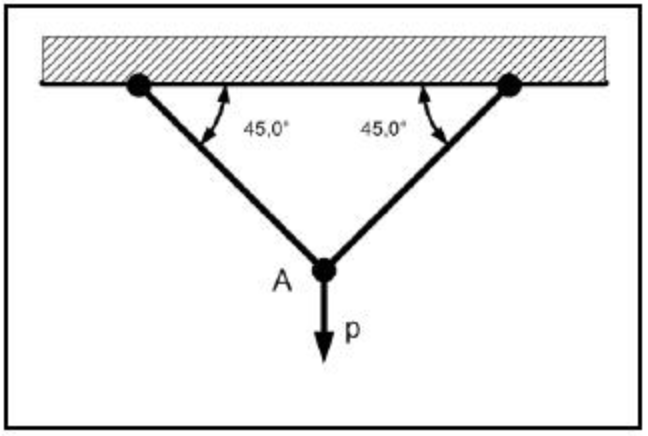
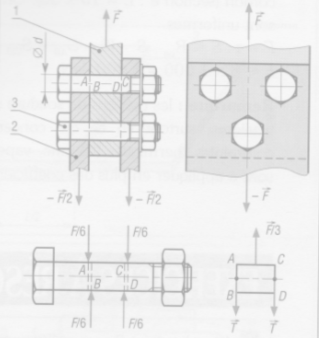

# RÉSISTANCE DES MATÉRIAUX - EXERCICES

## Exercice 1

**Déterminer** la charge axiale maximale que peut supporter un poteau en béton C25/30 de section 250x250 mm?

## Exercice 2

**Vérifier** la résistance d'un poteau cylindrique en bois C18 de diamètre 14 cm supportant une charge axiale F = 3600 daN.

## Exercice 3

**Déterminer** la section carrée nécessaire pour qu'un poteau en bois C24 résiste à une charge axiale de 12 kN.

## Exercice 4

**Vérifier** sa résistance d'un poteau HEA160 en acier S235, sollicité par une charge de 58 kN.  

## Exercice 5

Un poteau cylindrique en béton armé C25/30 reprend une charge de 1,3 MN.   
**Déterminer** son diamètre minimal. _On arrondira au 10 cm supérieur._

-----
## TRACTION / COMPRESSION

### Exercice 1

Un câble en acier S185 de diamètre 6mm et de longueur 10m est soumis à 2 forces de 200daN qui tendent à l'allonger.    

* a. Quel est le type de contrainte supporté par le câble?
* b. Quelle est la valeur de cette contrainte?
* c. Quelle est la valeur de l'allongement de ce câble?

### Exercice 2

Une barre prismatique de section rectangulaire (25 mm x 50 mm) et de longueur 1 = 3,5 m est soumise à une traction axiale de 90 kM. On observe un allongement de 1,2 mm. 
**Calculer** la contrainte axiale ainsi que l'allongement relatif. Que vaut le module de Young ?

### Exercice 3

Deux tronçons (1) et (2) en matière plastique sont collés comme l'indique la figure ci-dessous.   
La résistance à la rupture par traction de la colle est de 235 daN/cm$^{2}$ pour des températures comprises entre -60 °C et 120 °C.   
Si la section collée est rectangulaire et mesure 50 x 70 mm, **déterminer** l'effort de traction admissible par le joint collé.

{: width=100%}

### Exercice 4

Deux barres d'acier identiques de 2,5 m de longueur sont assemblées par des broches ($\equiv$ articulation) et supportent une masse de 50000 kg à leur extrémité comme représenté sur la figure ci-dessous.    
**Calculer** la section des barres telle que la contrainte subie ne soit pas plus grande que 210 N/mm$^{2}$.    
*On donne le module de Young E = 210000 N/ mm$^{2}$*

{: width=70%}

## CISAILLEMENT

### a/ Assemblage rivetés

{: width=50%}

Pour certains types de construction (carlingues d'avion, etc.), les assemblages rivetés sont préférés aux assemblages soudés plus sensibles au phénomène de fatigue.    

^^Exemple :^^ les barres (1) et (2) sont liées par un rivet (3) en aluminium de diamètre d = 10 mm et de résistance à la rupture par glissement R$_{g}$ = 10 daN.mm$^{-2}$.    
**Déterminons** l'effort $\overrightarrow{F}$ admissible.    

^^Résolution:^^   
Nous avons une seule section cisaillée.

### b/ Assemblages boulonnés

{: width=50%}

Le mode de calcul et les remarques sont identiques aux assemblables rivetés.   

^^Exemple :^^ pour l'assemblage proposé, à trois boulons ajustés en acier, d = 12 mm, la contrainte admissible au cisaillement des boulons R$_{pg}$ = 30 daN.mm$^{-2}$.   
**Déterminons** l'effort $\overrightarrow{F}$ admissible.

### c/ Articulation cylindrique

{: width=50%}

Une articulation cylindrique entre deux barres plates 1 et 2 est réalisée comme l'indique la figure.    
La liaison est assurée par un axe cylindrique 3 de diamètre $d$ inconnu. L'effort maximal supporté par la liaison est de 5000 daN.
La résistance pratique (ou admissible) au cisaillement du matériau de l'axe est de 5 daN.mm$^{-2}$.    
**Déterminer** le diamètre d de l'axe 3.    
**Indiquer** la (ou les) section(s) cisaillée(s).

