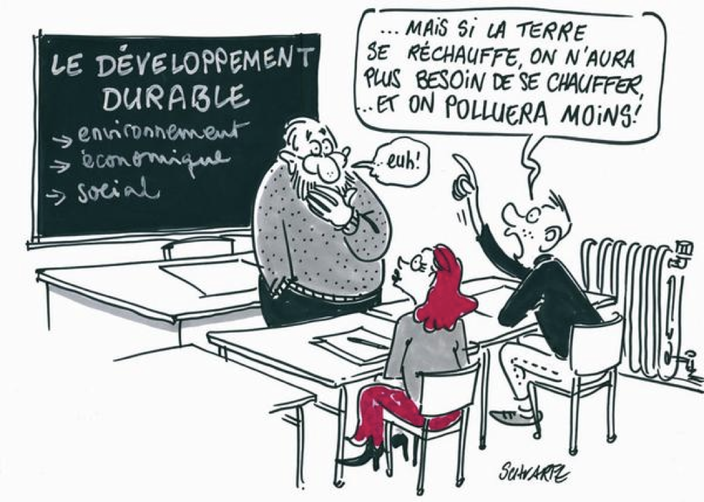

## PRÉSENTATION DES OBJECTIFS DE LA SÉQUENCE

{width=400px} 

## ORGANISATION:

* Groupes de 3/4 élèves ,
* Objectif : présentation en classe de 5 min accompagnée d’un support multimédia (Diaporama, vidéo, bande son, images…),

## CONTENU DE LA PRÉSENTATION:

* Quelle est la problématique ?
* En quoi est-ce une question de développement durable (aspect économique, social, environnemental) ?
* Quels sont les problèmes posés par la situation actuelle ?
* Quelles sont les solutions proposées ?
* Conclusion ou définition de 3 à 5 lignes.

## NE PAS OUBLIER:

* Préparez votre texte avant de passer à l’oral, de vous enregistrer ou de vous filmer,
* Utilisez le cours que vous avez reçu ,
* Ne lisez ni votre cours, ni votre livre, ni le contenu d’un site Internet en guise de commentaire,
* Sélectionnez les documents que vous allez commenter,
* Tous les membres du groupe doivent intervenir.

## POINTS ÉVALUÉS:

* Respect du sujet,
* Analyse de la problématique, utilisation du cours, des documents,
* Pertinence des sources,
* Soin dans la production finale,
* Respect du temps imparti,
* Originalité de la mise en forme,
* Vocabulaire précis, expression orale.

Vous serez évalué à partir du fichier suivant:  
{:width=3%} [Seq1_Évaluation](./Evaluation/Seq00_Evaluation_Oral.xlsx){:target="_blank"}

## LES SUJETS :

1. La démarche zéro déchets : qu’est-ce que c’est ?
2. Est-il possible de n’utiliser que de l’électricité issue de sources renouvelables ?
3. L’énergie photovoltaïque ou éolienne est-elle vraiment écologique ?
4. Le tri du papier sert-il à quelque chose ?
5. Qu’est-ce que l’obsolescence programmée ?

## LA PROCÉDURE:

### Etape 1 - Préparation du texte

* D’où je pars : Je prépare une introduction (3 ou 4 phrases ; 1 min) qui présente le sujet, la problématique.
* Par où je passe : J’énumère 3 idées ou 3 points dont je veux parler.
* Où je vais : Je prépare une conclusion ou une définition (3 ou 4 phrases ; 1 min) qui est ma réponse à la problématique.

### Etape 2 - Écriture du texte

* Je complète le texte préparé en formulant mes idées.
* Je chronomètre mon intervention.
* Si elle est trop longue, je résume ou je coupe.
* Si elle est trop courte, je rajoute des idées, des chiffres.

### Etape 3 - Préparation du support multimédia

* Des titres.
* Peu de texte, sauf pour une définition, un nom, une date ou des chiffres-clés.
* Des images, des bandes sons, des vidéos d’illustration de mon exposé.
* 1 ou 2 diapositives par idée.

