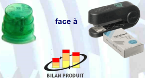

# PROBLÈME TECHNIQUE

## Description de la problématique technique

{:width=50%}

Un rapport affirme que l'agrafeuse sans agrafes « Green Emma » est plus impactante pour l'environnement que l'agrafeuse « Skrebba », qui nécessite pourtant l'usage d'agrafes.

Cette affirmation a mis la société productrice de l'agrafeuse Green Emma dans l'embarras, car le slogan pour cette entreprise est justement de réaliser des produit peu impactant. De ce fait, la société vous demande d'étudier leur produit et d'envisager des pistes pour améliorer le bilan :

* Est-ce possible ?
* Si tel est bien le cas, peut-on reconcevoir l'agrafeuse Green Emma pour la rendre moins impactante pour l'environnement que sa concurrente ?

## Description de la production attendue

Dans le but de répondre aux questions ci-dessus, vous allez effectuer au long de ce TP les activités suivantes :

* Compte-rendu présentant la définition des différents impacts environnementaux évalués lors de l'analyse du cycle de vie (ACV) d'un produit.
* Démontage, pesage, identification des matériaux et des procédés de fabrication des différentes pièces de l'agrafeuse Skrebba.
* Évaluation quantitative des impacts de l'agrafeuse Skrebba avec le logiciel "Bilan Produit" et comparatif avec le modèle Green-Emma.
* Étude comparative avec deux autres types d'agrafeuses et conclusions.
* Reconception sous Solidworks de l'agrafeuse Green-Emma pour la rendre moins impactante que sa concurrente.
* Modification du fichier "Bilan Produit" et nouvelle comparaison des deux agrafeuses.

Pour mesurer l'impact environnemental de chacun de ces produits, nous allons utiliser le logiciel « Bilan Produit » développé par l'Université de Cergy-Pontoise et distribué par l'ADEME (Agence pour la Maîtrise de l'Énergie). Le logiciel est en lien ci-dessous avec les fichiers nécessaires.

[Agrafeuse_BP.zip](./ressources/Agrafeuse_BP.zip)
