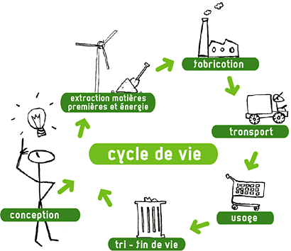
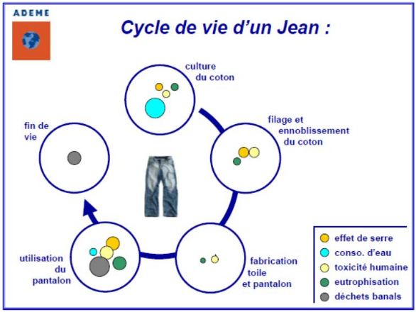

# ANALYSE DE CYCLE DE VIS (ACV)

{:width=100%}

## PRINCIPE DE L'ACV

Le cycle de vie commencent à l'extraction des matières première jusqu'à son élimination (fin de vie ou recyclage). Il est nécessaire de prendre en considération toutes les étapes afin d'éviter un déplacement des problèmes (impacts écologiques, conditions sociales...).   

La démarche d'éco-conception ou d'éco-construction s'inscrit totalement dans ce cycle.

{:width=100%}

A chaque étape:

* Un produit consomme de l'énergie ou des matières premières non-renouvelable.
* Un produit crée des impacts sur l'air, l'eau, le sol.

## UNITE FONCTIONNELLE
L'unité fonctionnelle (UF) est la grandeur quantifiant la fonction principale du système.    
L'UF ert de base pour permettre la comparaison de différents scénarios.

{:width=100%}

## EXEMPLE D'APPLICATION D'ACV

* Choix de conception de produit (démarche d'éco-conception).
* Choix de procédé ou de filière d'élimination des déchets.
* Décision d'investissement.
* Aide à la définition d'une politique publique.
* Elaboration des critères d'écolabels.
* Promotion, communication.
* etc...

{:width=100%}