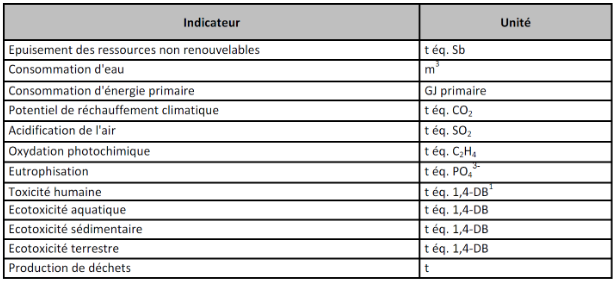
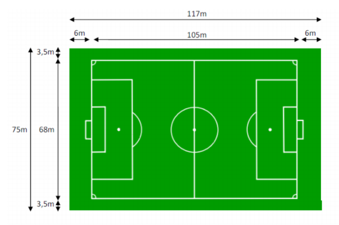
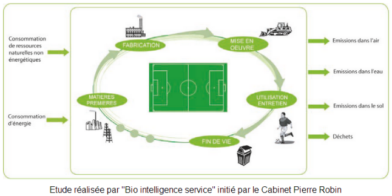
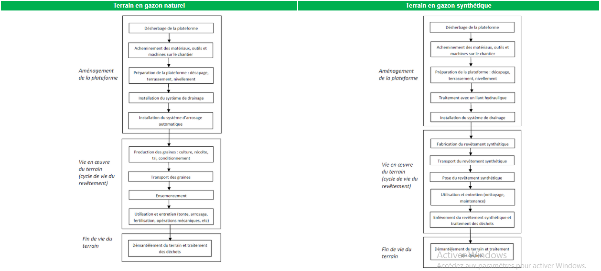
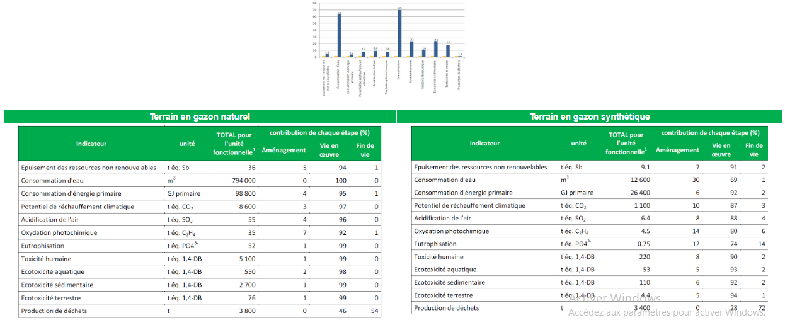

# ACV D'UN TERRAIN DE FOOT

{:width=100%}

## LES INDICATEURS

12 indicateurs ont été étudiés afin d'évaluer les impacts environnementaux potentiels des terrains de football sur leur cycle de vie.

{:width=100%}

## DESCRIPTION DES TERRAINS ETUDIES

{:width=100%}

Les produits à terrains de football à considérer sont de bonne qualité, répondant aux normes NF P90-112 (gazon synthétique) et NF P90-113 (gazon naturel), et sont entretenus en conséquence.

Ils sont utilises 9 mois par an (période estivale exclue) selon une fréquence hebdomadaire moyenne différente selon le type de gazon.

Le tableau suivant présente les caractéristiques des deux types de terrains :

{:width=100%}

## LES ETAPES DU CYCLE DE VIE

{:width=100%}

Cette étude prend en compte les étapes de cycle de vie suivantes :

* **Aménagement initial :** désherbage de la plate-forme, décapage, terrassement, nivellement, installation du système de drainage ainsi que du système d'arrosage dans le cas du gazon naturel.
* **Fabrication et pose du revêtement** dans le cas du gazon synthétique; production et ensemencement des graines dans le cas du gazon naturel.
* **Utilisation et entretien :** nettoyage et maintenance pour le gazon synthétique; tonte; arrosage et opérations mécaniques d'entretien pour le gazon naturel.
* **Fin de vie :** démantèlement des terrains et traitements des déchets.

{:width=100%}

## LES RESULTATS

{:width=100%}
