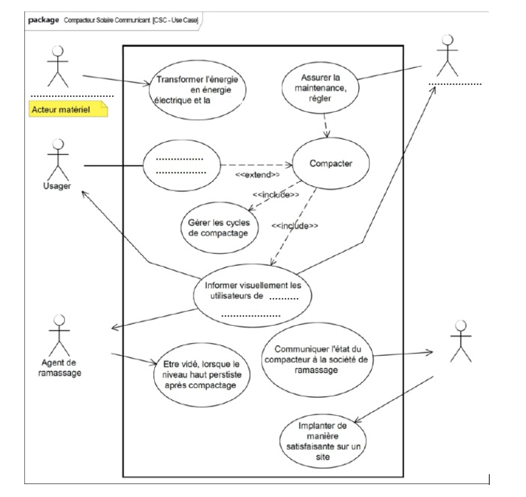
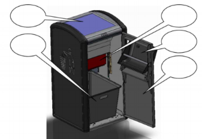
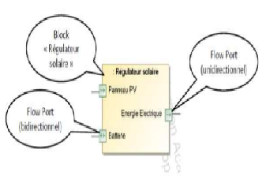
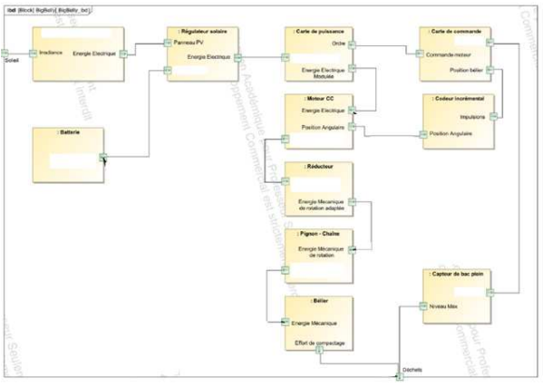

# SEQUENCE 4 : COMMENT CARACTERISER LES FLUX AU SEIN D'UN SYSTEME ?

## THEME D'ETUDE

Dans cette activité, vous allez **découvrir** les différents flux au sein d’un système du **laboratoire**.

## A VOTRE DISPOSITION

Vous avez, à votre disposition :

* Vos camarades ;
* Vos enseignants ;
* Votre ordinateur et les logiciels installés
* Vos écouteurs ;
* Une vidéo ;
* Le dossier technique du système
* Le système.

## SYSTEME ETUDIE : LE COMPACTEUR BIGBELLY

### Introduction et présentation du système

{:width=50%}

La société américaine Big Belly Solar, située à Newton dans le Massachusetts a conçu un système de compactage des déchets qui permet à une corbeille de rue de contenir cinq fois plus de déchets pour un même volume ainsi réduisant les corvées liées
au ramassage, les débordements disgracieux d’ordures ainsi que l’impact polluant de collectes inutiles.

Au lieu d’être relié au réseau électrique, "BigBelly" l’énergie solaire à 100 % pour ses besoins en énergie. En effet, il est équipé d’un panneau solaire de 305 Watts heurs /jours.

L’appareil prend autant de place qu’une poubelle classique mais sa capacité est cinq fois plus élevée. Le mécanisme de compactage de "BigBelly" exerce une pression de 5O kg.

1. A partir de la description ci-dessus, **indiquer** le besoin associé au développement durable auquel répond le compacteur BigBelly. **Expliquer** en quoi la source d’énergie participe elle aussi au développement.
2. **Compléter** les éléments manquants du diagramme des cas d’utilisation ci-dessous.
3. A partir du diagramme des cas d’utilisation (SYSML), **indiquer** la procédure avec les acteurs intervenants lorsque la poubelle est pleine.

{:width=100%}

4. Sur le [document réponse](./ressources/bigbelly/S3A1_BigBelly.pdf), repérer les éléments suivants : trappe, belier, porte, panneau photovoltaique, bac.

{:width=100%}

5. Indiquer comment sont "simulés" les détritus. 

### Analyse comportementale : Diagramme de blocs internes (IDB).

Le diagramme de bloc interne (Internal Bloc Diagram-IDB) est l'un des diagrammes du modèle SYSML permettant de représenter un système.    

{:width=50%}

Ce diagramme permet de représenter les flux (Flows) entre les constituants internes du système, appelés "Blocks".
Ces flux peuvent être de 3 natures :

* Matière (M)
* Energie (E)
* Information (I)

Les blocks disposent de ports de flux (Flow Port) : ils peuvent être de nature : 

* Unidirectionnel (In ou Out)
* Bidirectionnel, dans ce cas le flux peut rentrer ou sortir du block.

Sur le document réponse, répondre aux questions suivantes :

1. Sur le document réponse, Compléter le digramme IBD avec les éléments suivants électrique ($\times$2), énergie mécanique de rotation ($\times$2), Batterie, énergie mécanique de translation, photovoltaïque.
2. A partir du diagramme IBD du compacteur BigBelly ci-dessous, déterminer les éléments extérieurs au système, entourer les Flows ports correspondants.
3. Tracer en bleu le flux d’énergie principal, depuis la batterie jusqu'aux déchets.
4. Tracer en bleu pointillé le flux d’énergie de charge, depuis le soleil jusqu’à la batterie.
5. Tracer en vert pointillé les 2 flux d’informations permettant à la carte de commande de connaître l’état du système.
6. Tracer en vert le flux d’information permettant la commande du moteur.
7. Pour chaque block du diagramme IBD, donner le groupe auquel il appartient.

**Chaine d'énergie : ALIMENTER, DISTRIBUER, CONVERTIR et TRANSMETTRE**
**Chaine d'information : ACQUERIR, TRAITER, COMMUNIQUER**

{:width=100%}

